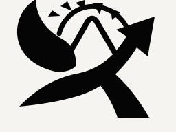

# Afadhali



**Measure what you have. Match what you waste.**

Afadhali is an early-stage resource efficiency platform for businesses in East Africa. It helps companies understand what they consume and discard, identify useful connections between waste streams, and find cleaner alternatives for what cannot be reused.

The public site is currently focused on building the first waitlist. The operating platform is being developed behind the scenes.

## What Afadhali Does

Afadhali follows a simple three-step model:

### 1. Audit

We measure what a business actually uses and produces, including:

- Energy sources and monthly costs
- Equipment and production efficiency
- Water use
- Waste materials, volumes, frequency, and current handling

The result is a clear picture of where resources are being lost and where improvement is possible.

### 2. Match

One company's by-product may be another company's input. Afadhali compares material type, volume, and distance to identify practical opportunities for reuse between businesses.

### 3. Swap

When a waste stream cannot be matched locally, Afadhali can help identify cleaner alternatives such as solar sizing, efficient equipment, biogas conversion, or better packaging options.

## Who It Is For

Afadhali is being shaped for businesses and cooperatives working in sectors such as:

- Coffee and tea
- Manufacturing
- Hospitality
- Agriculture
- Healthcare
- Construction
- Transport
- Education
- Retail
- Textiles
- Mining
- Digital infrastructure

The method can also apply to businesses outside these sectors. Every business consumes resources and discards something.

## Join The Waitlist

Businesses can join the waitlist at the public contact page. The form asks for:

- Contact name
- Company or cooperative name
- Company email
- Contact number
- Sector
- What the company produces or discards

Submissions are saved in the Afadhali Supabase database. The founder can review them from the admin area under **Leads from the contact form**, or directly from the `leads` table in Supabase.

After a successful submission, the visitor sees an on-page confirmation. No paid email provider or custom domain is required for the current waitlist flow.

## Current Stage

Afadhali is currently in its first phase:

- Public website and waitlist are live
- Waitlist submissions are being collected
- Audit, matching, and platform workflows are under development
- Public partner, funder, and team pages are intentionally limited until those relationships exist

The goal is to learn from the first businesses on the list and build the product around real resource and waste challenges.

## Contact

Email: [afadhali.ltd@gmail.com](mailto:afadhali.ltd@gmail.com)

## Development

This website is built with React, TanStack Start, Vite, TypeScript, Tailwind CSS, and Supabase.

### Requirements

- Node.js
- npm
- A Supabase project for the waitlist and platform data

### Run locally

```sh
npm install
npm run dev
```

Create a local `.env` file with the Supabase values used by the application:

```env
VITE_SUPABASE_URL=your_supabase_url
VITE_SUPABASE_ANON_KEY=your_supabase_anon_key
```

The `.env` file is ignored by Git. Do not commit API keys or other secrets.

### Useful commands

```sh
npm run dev       # Start the development server
npm run build     # Create a production build
npm run lint      # Run ESLint
```

## Project Structure

```text
public/                 Static assets, including the Afadhali logo
src/components/site/    Public header and footer
src/components/platform/ Admin and platform shell components
src/lib/afadhali/       Auth, Supabase connection, store, and data types
src/routes/             Public pages and platform routes
src/styles.css          Shared design system and global styles
```

Afadhali is being built to make better resource use practical, measurable, and useful for the businesses doing the work.
